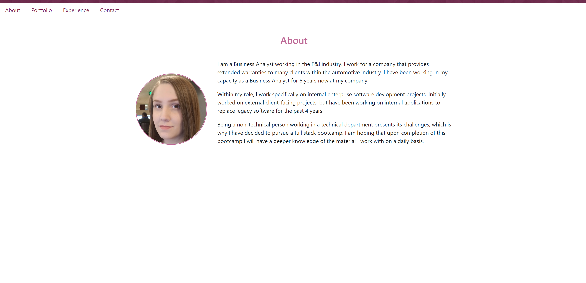

# React Portfolio
React Portfolio Site

## Description

The purpose of this assignment is to create a React portfolio site utilizing re-usable components across multiple pages.

---
## Usage

To view the live site click [here](https://ewells89.github.io/react-portfolio).

To access a copy of the repository for local use:
* Download a copy of the repository by performing a git pull onto your local machine.
* Install the dependent NPM packages and enter the 'npm start' command.
* Otherwise, open the repository using your preferred IDE.

### Preview

---
## Credits

### Individuals:
* Ga Tech Boot Camp Class

---
## License

Copyright (c) 2020 Elyse Wells

Permission is hereby granted, free of charge, to any person obtaining a copy
of this software and associated documentation files (the "Software"), to deal
in the Software without restriction, including without limitation the rights
to use, copy, modify, merge, publish, distribute, sublicense, and/or sell
copies of the Software, and to permit persons to whom the Software is
furnished to do so, subject to the following conditions:

The above copyright notice and this permission notice shall be included in all
copies or substantial portions of the Software.

THE SOFTWARE IS PROVIDED "AS IS", WITHOUT WARRANTY OF ANY KIND, EXPRESS OR
IMPLIED, INCLUDING BUT NOT LIMITED TO THE WARRANTIES OF MERCHANTABILITY,
FITNESS FOR A PARTICULAR PURPOSE AND NONINFRINGEMENT. IN NO EVENT SHALL THE
AUTHORS OR COPYRIGHT HOLDERS BE LIABLE FOR ANY CLAIM, DAMAGES OR OTHER
LIABILITY, WHETHER IN AN ACTION OF CONTRACT, TORT OR OTHERWISE, ARISING FROM,
OUT OF OR IN CONNECTION WITH THE SOFTWARE OR THE USE OR OTHER DEALINGS IN THE
SOFTWARE.

---